# Fitness-Finesse

## VIDEO
<a href="https://drive.google.com/file/d/1U-mYXe0EyjHDPMS4MiKb6CLu4FtXgb4Y/view?usp=sharing">Fitness-Finesse Video Link</a>

### AIM

Creation of GIS-based national inventory of sports infrastructure
(FITNESS FINESSE)

### ABSTRACT

When a person is looking for fitness centers,fitness products or diet plans,he need to visit different websites or there are just one or two options available that too offering them only there products.Therefore, user often end up with limited options for fitness centers or buying expensive diet plans or expensive products. 

### SOLUTION

We would be making a app in which user can browse through different fitness center , can get appropriate diet plans(free/paid) according to their fitness goals,can  compare prices of different dietitians , can compare their experience and reviews.User will also get almost all fitness related product,can compare price of different products,will get a certification symbol if coming from official store.

Fitness product sellers, Fitness center owners , Dietitians can sell there products,display there fitness centers,can find people looking for dietitians etc.

*Data Security For All. 

### USER FEATURES
*LOGIN/LOGOUT  
*BUY PRODUCTS  
*BROWSE FITNESS CENTERS  
*COMPARE PRICES  
*GET CUSTOMIZED DIET  

### ASSOCIATE FEATURES
*ASSOCIATE THEIR FITNESS CENTERS 
*ASSOCIATE THEIR PRODUCT 
*DIETICIANS CAN ASSOCIATE THEMSELVES

### Images

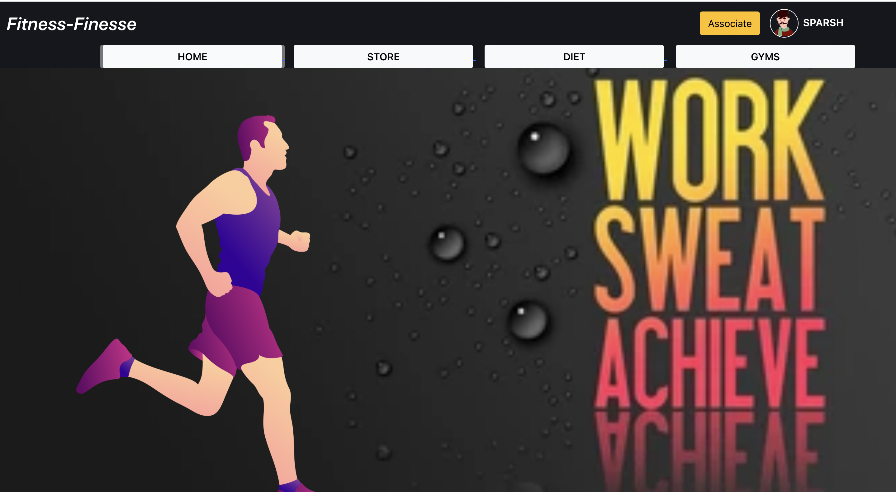

*** ***
<kbd align="center">
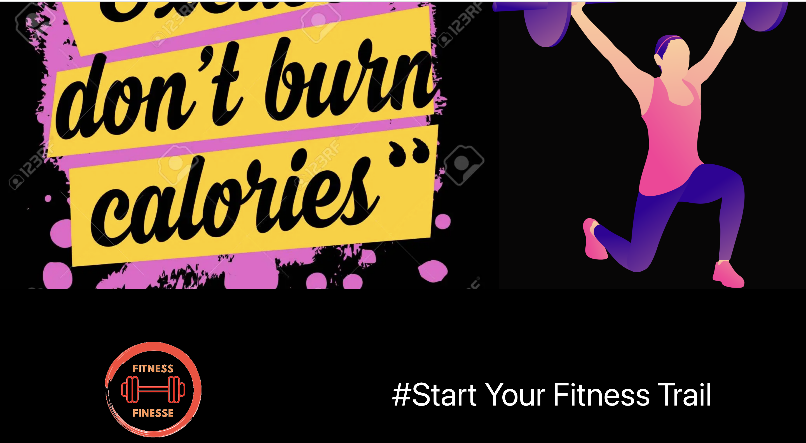

</kbd>

*** ***

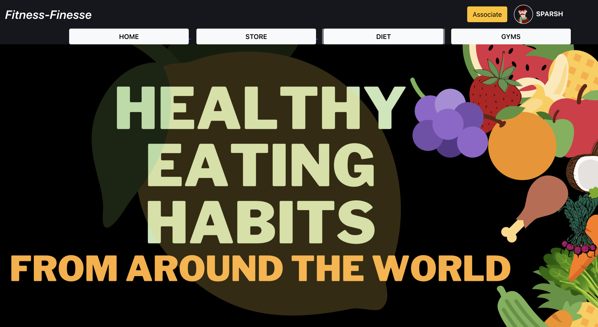

*** ***
<kbd align="center">
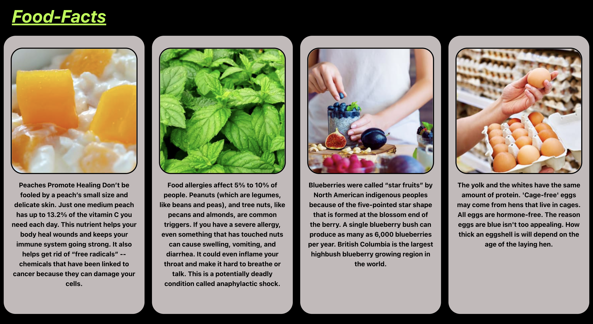

</kbd>

*** ***
<kbd align="center">
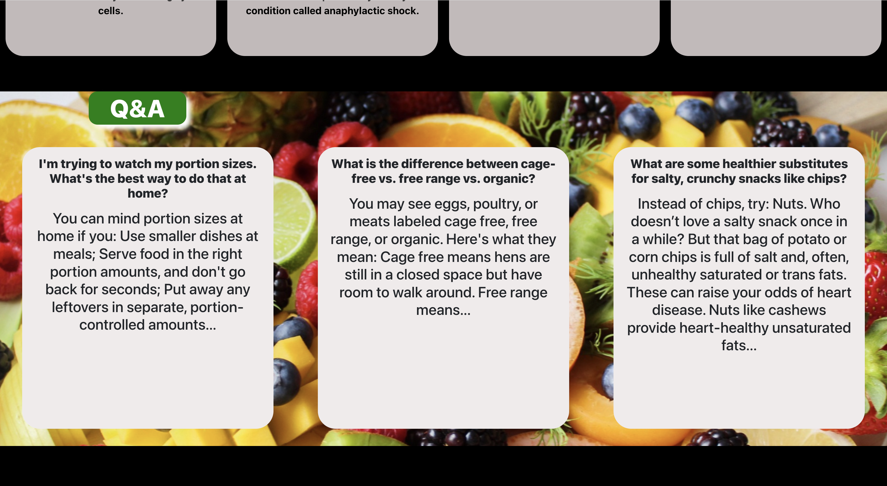

</kbd>

*** ***
<kbd align="center">
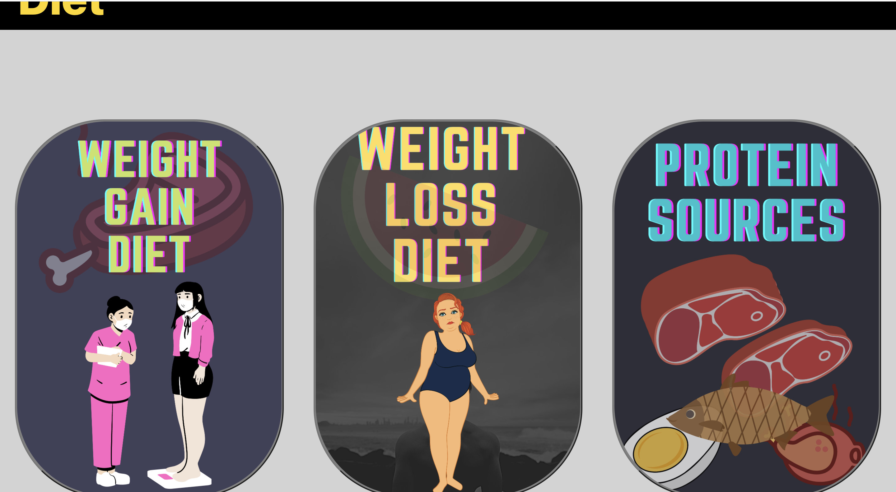

</kbd>

*** ***
<kbd align="center">
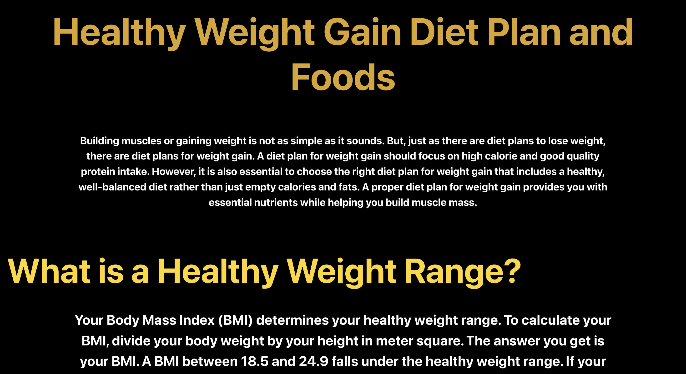

</kbd>

*** ***
<kbd align="center">
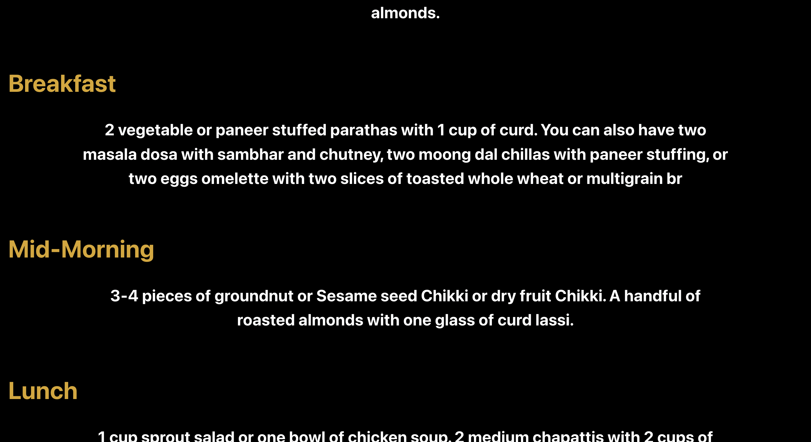

</kbd>

*** ***
<kbd align="center">
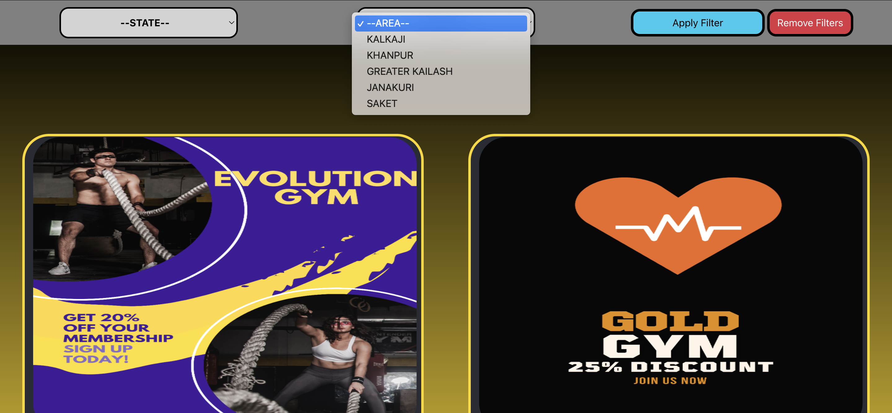

</kbd>

*** ***
<kbd align="center">
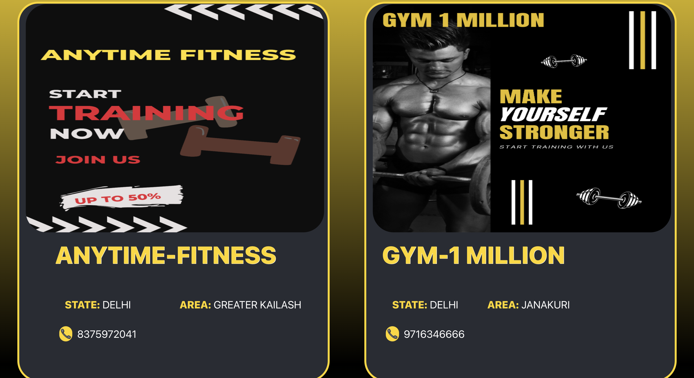

</kbd>

*** ***
<kbd align="center">
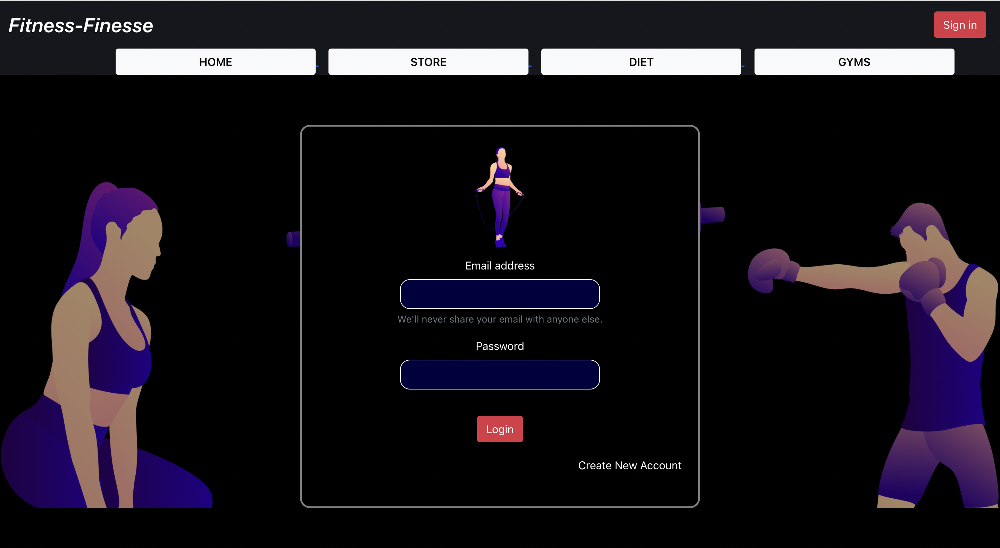

</kbd>

*** ***
<kbd align="center">
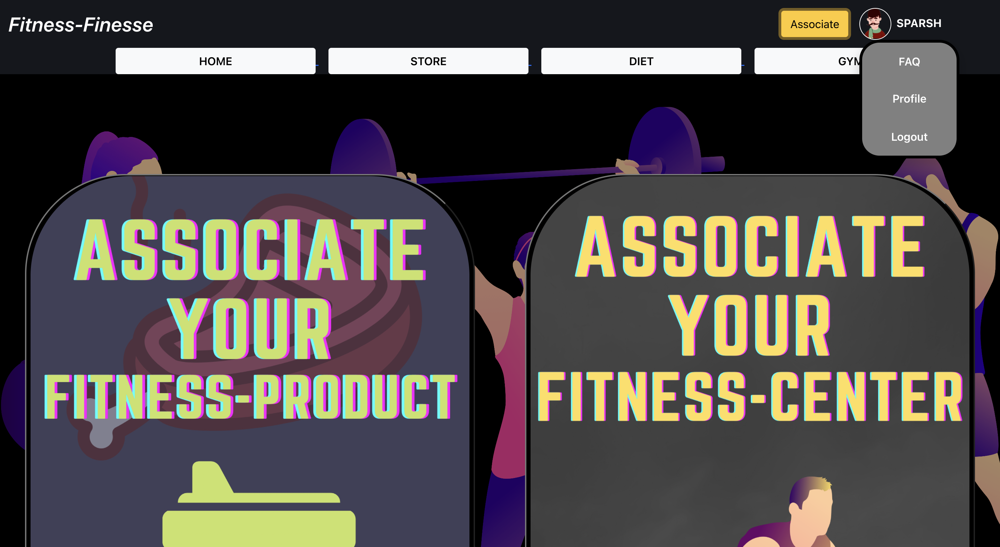

</kbd>
